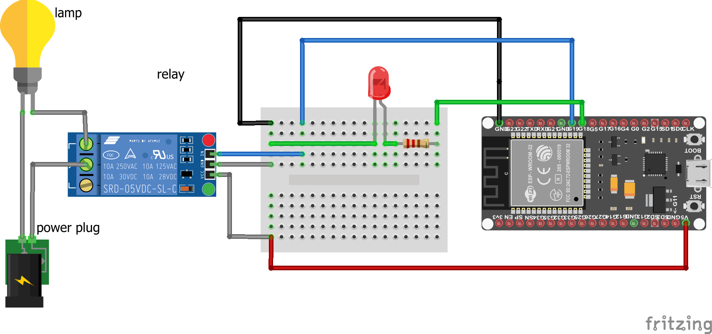

# led-relay

The brightness of the led increases, when it reaches 50% the relay is ON, the brightness keeps increasing until it reaches 100% then it decreases, when it reaches 50%, the relay is OFF.

## Description

- The wiring diagram

- The arduino code is in "led+relay.ino".
## Authors

Maker Skills : https://makerskillsup.com

## Version History

- 0.1 : initial release (29/08/2023)

## License

This project is licensed under the [MIT] License - see the LICENSE.md file for details
