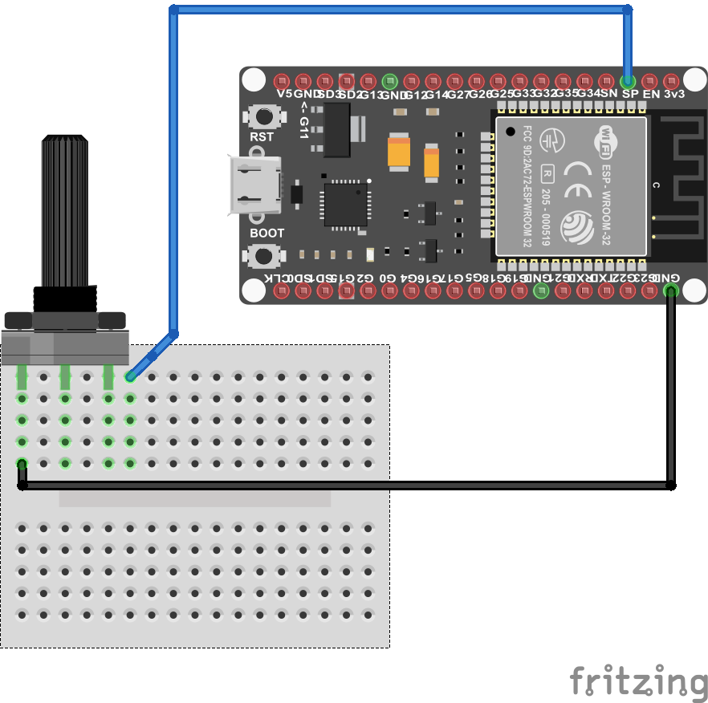

# Serial_monitor-potentiometer

Visualize the potentiometer values on the serial monitor. Each 5 seconds the value of the potentiometer will be displayed on the serial monitor.

## Description

- The wiring diagram

- The arduino code is in "serial_monitor-potentiometer.ino".
## Authors

Maker Skills : https://makerskillsup.com

## Version History

- 0.1 : initial release (29/08/2023)

## License

This project is licensed under the [MIT] License - see the LICENSE.md file for details
