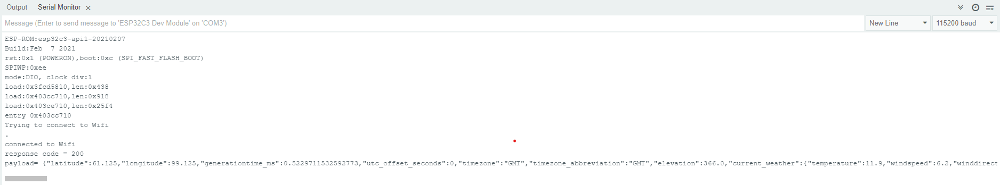

# ESP_sends_http_requests

The ESP board connects to wifi, acquires data from a web server, and displays them on the serial monitor. We chose a weather API server that sends weather information about a position (latitude,longitude) specified in the URL. 

## Description

- The arduino code is in "http_client.ino".

## Execution

## Authors

Maker Skills : https://makerskillsup.com

## Version History

- 0.1 : initial release (29/08/2023)

## License

This project is licensed under the [MIT] License - see the LICENSE.md file for details
